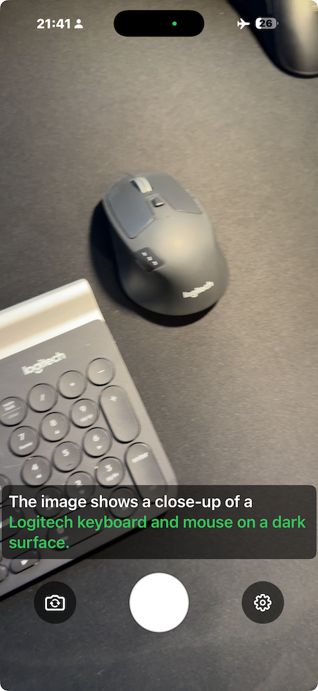
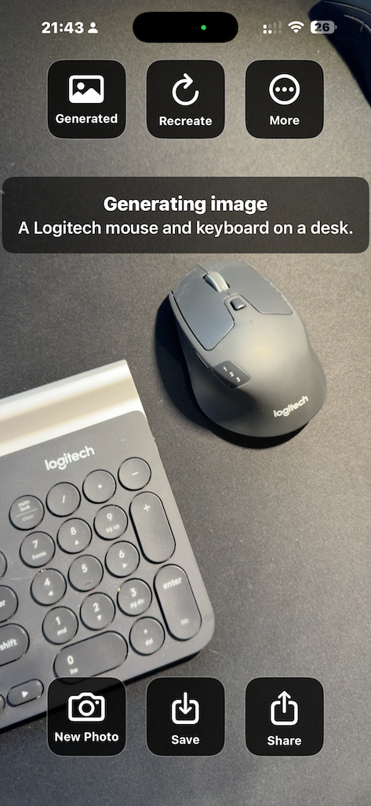
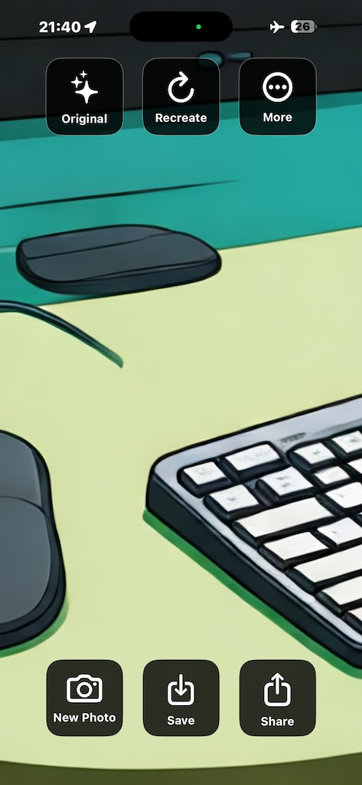
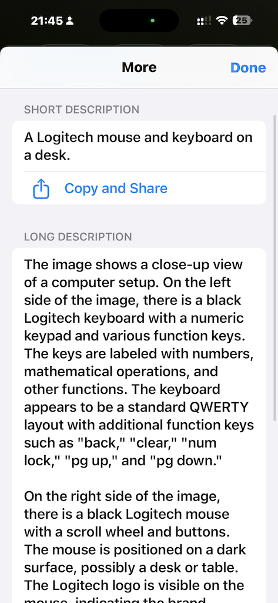

# GenAICam

This app is a **proof of concept** exploring privacy-focused, on-device machine learning. It can describe what it sees and generate pictures from those descriptions — all processed locally on your device.

Created for fun as a vibe coding experiment with [OpenAI’s Codex](https://openai.com/codex/). It’s released as **open source**, so anyone is welcome to explore, adapt, and modify it. More details and reflections are shared in this [Medium story](https://medium.com/@pizzato/i-will-never-code-an-app-again-b262893dca8c).

## Inspiration and attributions

Inspired by [Lingcam by Masaru Mizuochi](https://lingcam.mizumasa.net/), presented at [CVPR 2025 AI Art](https://thecvf-art.com/project/lingcam/)
                    

The project starting point was Apple’s [FastVLM repository](https://github.com/apple/ml-fastvlm), which introduced efficient vision encoding for vision-language models also at a [CVPR 2025 paper](https://openaccess.thecvf.com/content/CVPR2025/html/Vasu_FastVLM_Efficient_Vision_Encoding_for_Vision_Language_Models_CVPR_2025_paper.html)."

The image generation is done with [Apple Intelligence Playground](https://developer.apple.com/machine-learning/apple-intelligence-playground/) enabling a fully offline, on-device AI experience.

## Screenshots

<table>
    <tr>
        <td></td>
        <td></td>
        <td></td>
        <td></td>
    </tr>
</table>

## Disclaimer

This project is provided **as is**, without warranty of any kind. Use at your own risk. No guarantees are made regarding accuracy, reliability, or fitness for any purpose. By using this app, you agree that the developer is not liable for any outcomes, damages, or issues arising from its use.

## Open source and Software Licenses

This project was built on top of Apple's [FastVLM](https://github.com/apple/ml-fastvlm), see the [README](https://github.com/apple/ml-fastvlm/blob/main/README.md) for more details. I have removed the uplink to the main repository as it is not relevant to the original repository, that is, changes here should not create pull-requests over there.

---
*** 
___

Below is the original FastVLM Repo - README

# FastVLM

Demonstrates the performance of **FastVLM** models for on-device, visual question answering. 

<table>
<tr>
    <td></td>
    <td></td>
    <td></td>
</tr>
</table>

## Features

- FastVLM runs on iOS (18.2+) and macOS (15.2+).
- View Time-To-First-Token (TTFT) with every inference.
- All predictions are processed privately and securely using on-device models.

### Flexible Prompting

The app includes a set of built-in prompts to help you get started quickly. Tap the **Prompts** button in the top-right corner to explore them. Selecting a prompt will immediately update the active input. To create new prompts or edit existing ones, choose **Customize…** from the **Prompts** menu.

## Pretrained Model Options

There are 3 pretrained sizes of FastVLM to choose from:

- **FastVLM 0.5B**: Small and fast - great for mobile devices where speed matters.
- **FastVLM 1.5B**: Well balanced - great for larger devices where speed and accuracy matters.
- **FastVLM 7B**: Fast and accurate - ideal for situations where accuracy matters over speed.

To download any FastVLM listed above, use the [get_pretrained_mlx_model.sh](get_pretrained_mlx_model.sh) script. The script downloads the model from the web and places it in the appropriate location. Once a model has been downloaded using the steps below, no additional steps are needed to build the app in Xcode.

To explore how the other models work for your use-case, simply re-run the `get_pretrained_mlx_model.sh` with the new model selected, follow the prompts, and rebuild your app in Xcode. This step is optional as the app will now download the default model on its first launch.

### Model Download

The FastVLM weights are no longer bundled with the project. The first time the app runs it will download the default model automatically and cache it in the application support directory. No manual download step is required.

### Custom Model

In addition to pretrained sizes of FastVLM, you can further quantize or fine-tune FastVLM to best fit their needs. To learn more, check out our documentation on how to [`export the model`](../model_export#export-vlm).
If you download a different model size, delete the cached files in the application support directory before running the app again.
